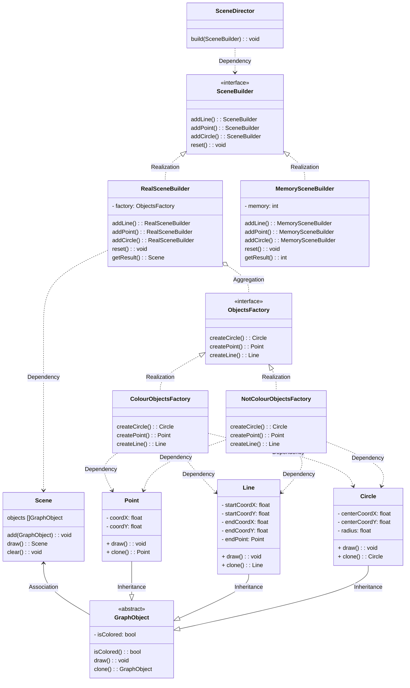

# Лабораторная работа №1

```mermaid
classDiagram
  direction TB

  class GraphObject {
    <<abstract>>
    - isColored: bool
    isColored(): bool
    draw(): void
    clone(): GraphObject
  }

  class Point {
    - coordX: float
    - coordY: float
    + draw(): void
    + clone(): Point
  }

  class Circle {
    - centerCoordX: float
    - centerCoordY: float
    - radius: float
    + draw(): void
    + clone(): Circle
  }

  class Line {
    - startCoordX: float
    - startCoordY: float
    - endCoordX: float
    - endCoordY: float
    - endPoint: Point
    + draw(): void
    + clone(): Line    
  }

  class ObjectsFactory {
    <<interface>>
    createCircle(): Circle
    createPoint(): Point
    createLine(): Line
  }

  class ColourObjectsFactory {
    createCircle(): Circle
    createPoint(): Point
    createLine(): Line
  }

  class NotColourObjectsFactory {
    createCircle(): Circle
    createPoint(): Point
    createLine(): Line
  }

  class Scene {
    objects []GraphObject
    add(GraphObject): void
    draw(): Scene
    clear(): void
  }

  class SceneBuilder {
    <<interface>>
    addLine(): SceneBuilder
    addPoint(): SceneBuilder
    addCircle(): SceneBuilder
    reset(): void
  }

  class RealSceneBuilder {
    - factory: ObjectsFactory
    addLine(): RealSceneBuilder
    addPoint(): RealSceneBuilder
    addCircle(): RealSceneBuilder
    reset(): void
    getResult(): Scene
  }

  class MemorySceneBuilder {
    - memory: int
    addLine(): MemorySceneBuilder
    addPoint(): MemorySceneBuilder
    addCircle(): MemorySceneBuilder
    reset(): void
    getResult(): int
  }

  class SceneDirector {
    build(SceneBuilder): void
  }

  SceneDirector ..> SceneBuilder: Dependency
  SceneBuilder <|.. RealSceneBuilder: Realization
  SceneBuilder <|.. MemorySceneBuilder: Realization

  RealSceneBuilder o.. ObjectsFactory: Aggregation
  RealSceneBuilder ..> Scene: Dependency

  ObjectsFactory <|.. ColourObjectsFactory: Realization
  ObjectsFactory <|.. NotColourObjectsFactory: Realization

  Scene <-- GraphObject: Association

  ColourObjectsFactory ..> Point: Dependency
  ColourObjectsFactory ..> Line: Dependency
  ColourObjectsFactory ..> Circle: Dependency
  
  NotColourObjectsFactory ..> Point: Dependency
  NotColourObjectsFactory ..> Line: Dependency
  NotColourObjectsFactory ..> Circle: Dependency

  Point --|> GraphObject: Inheritance
  Line --|> GraphObject: Inheritance
  Circle --|> GraphObject: Inheritance
```
