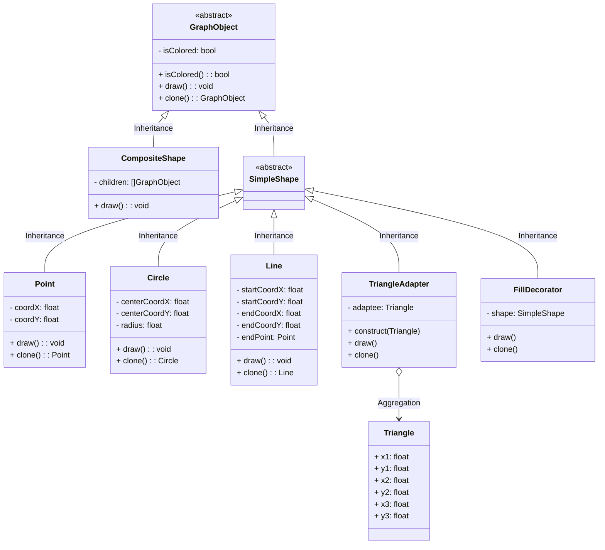

# Лабораторная работа №2

```mermaid
classDiagram
  direction TB

  class GraphObject {
    <<abstract>>
    - isColored: bool
    + isColored(): bool
    + draw(): void
    + clone(): GraphObject
  }

  class Point {
    - coordX: float
    - coordY: float
    + draw(): void
    + clone(): Point
  }

  class Circle {
    - centerCoordX: float
    - centerCoordY: float
    - radius: float
    + draw(): void
    + clone(): Circle
  }

  class Line {
    - startCoordX: float
    - startCoordY: float
    - endCoordX: float
    - endCoordY: float
    - endPoint: Point
    + draw(): void
    + clone(): Line    
  }

  class Triangle {
    + x1: float
    + y1: float
    + x2: float
    + y2: float
    + x3: float
    + y3: float        
  }

  class TriangleAdapter {
    - adaptee: Triangle
    + construct(Triangle)
    + draw()
    + clone()
  }

  class FillDecorator {
    - shape: SimpleShape
    + draw()
    + clone()
  }

  class CompositeShape {
    - children: []GraphObject
    + draw(): void
  }
  
  class SimpleShape {
    <<abstract>>
  }

  GraphObject <|-- SimpleShape: Inheritance
  GraphObject <|-- CompositeShape: Inheritance

  SimpleShape <|-- Point: Inheritance
  SimpleShape <|-- Line: Inheritance
  SimpleShape <|-- Circle: Inheritance
  SimpleShape <|-- TriangleAdapter: Inheritance
  SimpleShape <|-- FillDecorator: Inheritance
  
  TriangleAdapter o--> Triangle: Aggregation  
```
